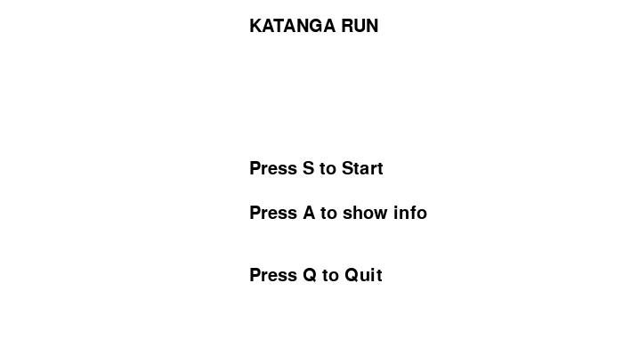
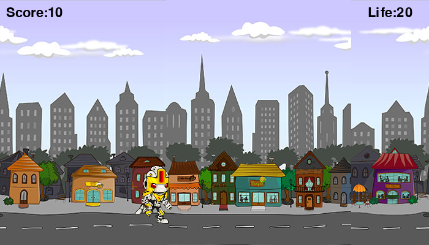
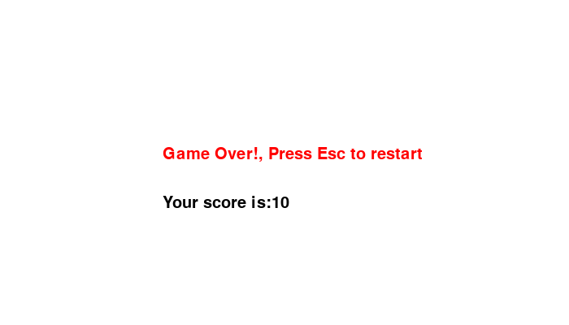

# katanga-run_v1.0.0
My first python project back in senior high school. Just a simple game made with the PyGame library with a scrolling background, a player and a few mobs.
You need python 2.7+ installed and PyGame.
Forgive me as this code is really old, and my first ever programming project, thus most of the code in there is "primitive" and unnecessary.

# Screenshots

